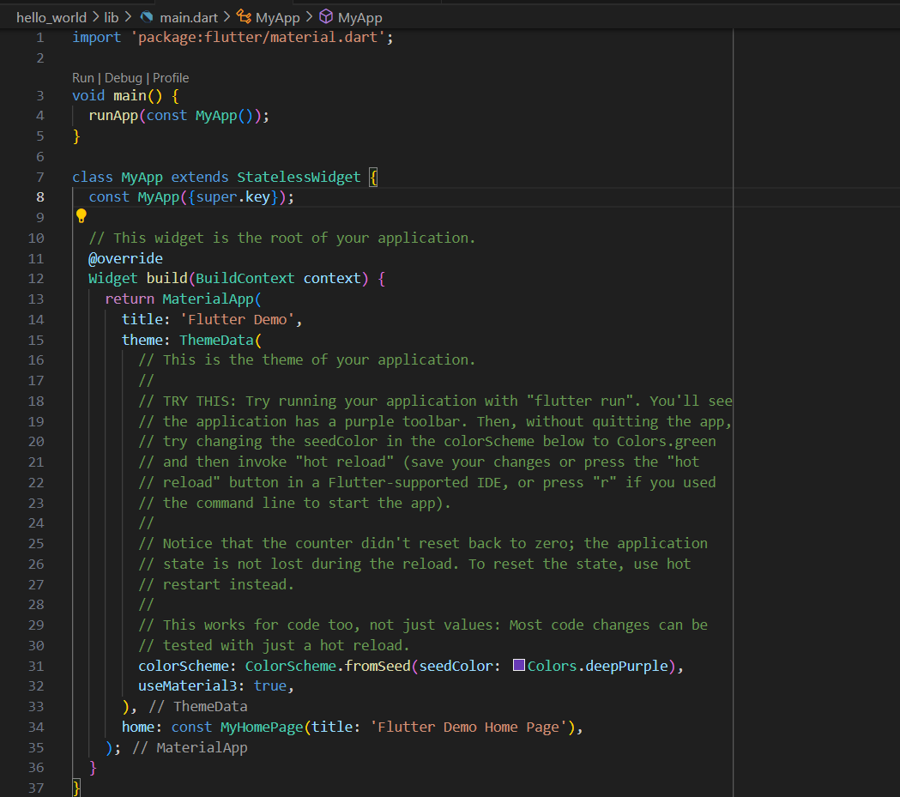
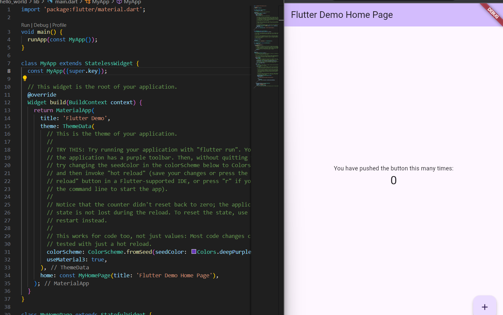

Nama  : Fatriya Ibnu Ash shidiqqi  
Kelas : TI 3B  
NIM   : 2241720138   

# Aplikasi Pertama dan Widget Dasar Flutter
### Praktikum 1: Membuat Project Flutter Baru

 

###  Praktikum 2: Menghubungkan Perangkat Android atau Emulator

### Praktikum 3 : Membuat Repository GitHub dan Laporan Praktikum

 